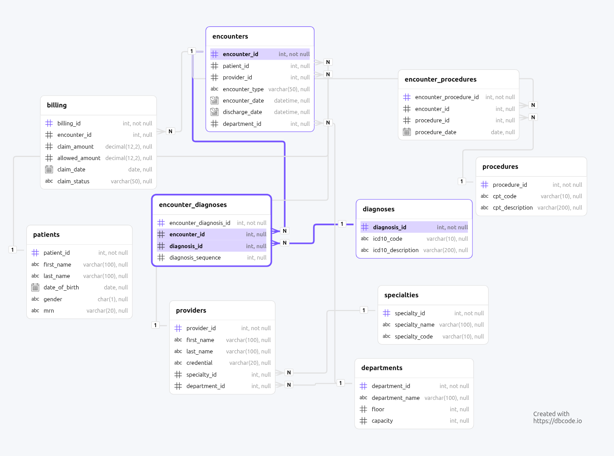
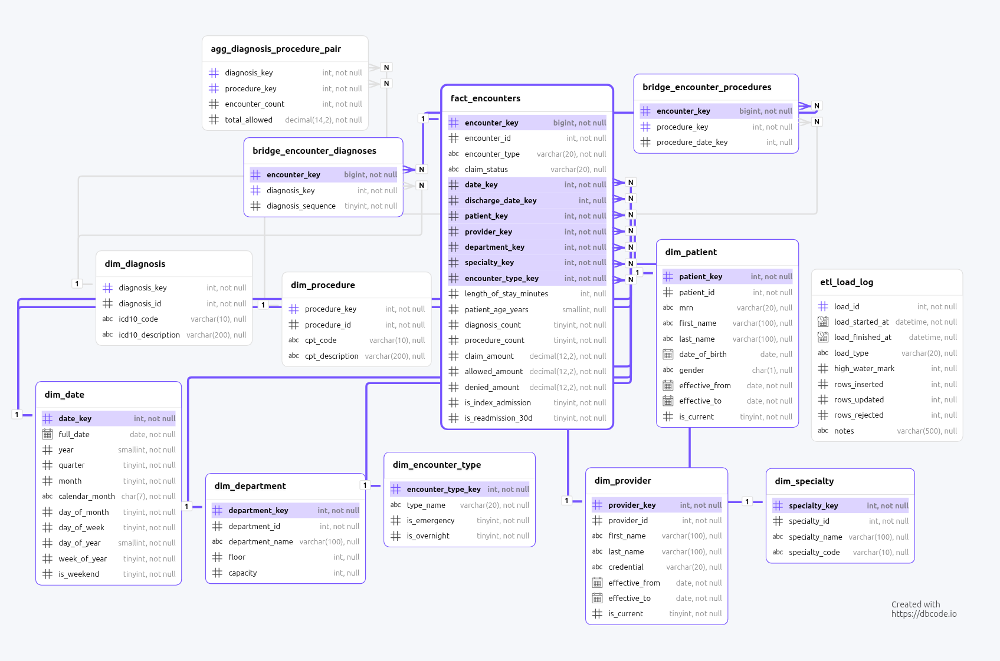

# Healthcare Analytics: OLTP to Star Schema

This Data engineering mini project takes a normalized (3NF) clinical transactional
database, measures where analytical queries fall over, then designs and builds
a Kimball star schema that fixes it.


This repo has a data generating script for stress testing and performance bechmarking. `300,000` patient encounters was used.

## Dataset

| Table | Rows |
|---|---|
| specialties | 12 |
| departments | 12 |
| providers | 60 |
| patients | 50,000 |
| diagnoses | 40 (real ICD-10) |
| procedures | 30 (real CPT) |
| encounters | 300,000 |
| encounter_diagnoses | 858,360 |
| encounter_procedures | 721,035 |
| billing | 300,000 |


## The core problem

The base discussion was that, for oltp (day-to-day transactional operations), normalization  is best fit but things becomes challenging when it comes to large scale analyses. That is where star schema comes in. 

## Schema diagrams

| OLTP (3NF) | Star schema |
|---|---|
|  |  |

## Results

Same four questions, same machine, same data. Median of 9 warm runs. Every star
query's output was diffed row-by-row against its OLTP counterpart before any
timing was recorded — all four are byte-identical.

| Query | OLTP | Star | Factor |
|---|---|---|---|
| Q1 Encounters by month/specialty | 0.566s | 0.294s | 1.92x faster |
| Q2 Diagnosis-procedure pairs | 9.874s | 0.024s | 411x faster |
| Q2b *same, bridges only, no aggregate table* | 9.874s | 2.224s | *4.43x faster* |
| Q3 30-day readmissions | 0.421s | 0.331s | 1.27x faster |
| Q4 Revenue by specialty/month | 1.034s | 0.162s | 6.38x faster |

 

## Layout

```
docs/     design decisions, ETL design, query analysis, reflection
sql/      for both schemas and queries
```

## Running it

Ran on MySQL 8.x. Two separate databases — one for oltp and one for star schema experiments.

```bash
mysql < sql/01_oltp_schema.sql     #     normalized source schema
mysql < sql/02_generate_data.sql   #    300k encounters, seeded
mysql < sql/03_oltp_queries.sql    #    the four questions, "before"
mysql < sql/04_star_schema.sql     #    dimensional model DDL
mysql < sql/06_star_queries.sql    #    the four questions, "after"
```


## Deliverables

| File |
|---|
| [docs/query_analysis.txt](docs/query_analysis.txt) |
| [docs/design_decisions.txt](docs/design_decisions.txt) |
| [sql/04_star_schema.sql](sql/04_star_schema.sql) |
| [docs/star_schema_queries.txt](docs/star_schema_queries.txt) |
| [docs/etl_design.txt](docs/etl_design.txt) |
| [docs/reflection.md](docs/reflection.md) |

`EXPLAIN ANALYZE` output behind every timing
claim.

